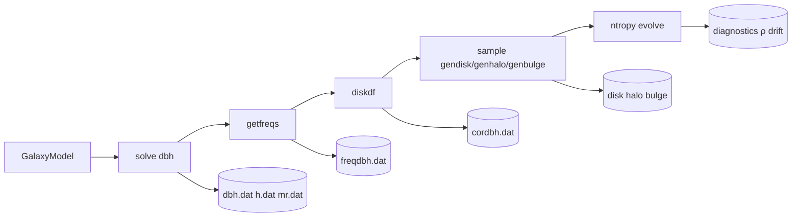

# GalactICS algorithm and Python pipeline

This document describes the full GalactICS initial-condition workflow as implemented
in this repository: the multipole Poisson solver (`dbh`), distribution-function
tables, disk DF correction (`diskdf`), particle sampling (`gendisk` / `genhalo` /
`genbulge`), and short N-body stability checks with **ntropy**. It is written to
match the legacy Fortran/C numerics; legacy routine names are cited where they help
navigate `legacy/fortran/`.

For Python-backend performance knobs and the `dbh.dat` variable glossary, see
[`dbh_python_backend.md`](dbh_python_backend.md). For OpenMP particle sampling,
bulge DF equilibrium, and potential-based virial checks, see
[`ic_sampling.md`](ic_sampling.md). End-to-end GPU BH usage:
[`notebooks/gpu_bh_dbh.ipynb`](../notebooks/gpu_bh_dbh.ipynb). PR CI gate:
[`ci_essential.md`](ci_essential.md).

---

## End-to-end pipeline

At the highest level, a galaxy model flows through four stages:



### Python entry points

| Stage | Public API | Legacy executable | Primary output |
|-------|------------|-------------------|----------------|
| Model | `GalaxyModel`, `GalaxyBuilder` | `in.dbh` | — |
| Poisson solve | `solve_potential()` → `python_solve_potential()` | `dbh` | `dbh.dat`, `h.dat`, `mr.dat`, `rtidal.dat`, DF tables |
| Frequencies | `tabulate_frequencies()` | `getfreqs` | `freqdbh.dat` |
| Disk DF | `python_ensure_disk_df()` → `solve_diskdf_python()` | `diskdf` | `cordbh.dat`, `toomre2.5` |
| Sampling | `GalaxyBuilder.sample()` → `sample_*_python()` (OpenMP `_sampler_c` by default) | `gendisk`, `genhalo`, `genbulge` | `disk`, `halo`, `bulge` (ASCII particles) |
| Stability | `ntropy.integrations.galacticsics` | — | energy drift, ρ(r), Σ(R) |

The default physics backend is **Python** (`galacticsics.physics.python_backend`).
Set `GALACTICSICS_PHYSICS_BACKEND=legacy` or `backend="legacy"` to invoke
`legacy/bin/*` via subprocess.

### Artifact dependency graph (Milky Way makefile)

```
in.dbh  →  dbh  →  dbh.dat, h.dat, mr.dat, rtidal.dat, denspsi*.dat, dfnfw.dat
dbh.dat + h.dat  →  getfreqs  →  freqdbh.dat
dbh.dat + freqdbh.dat  →  diskdf  →  cordbh.dat
dbh.dat + cordbh.dat + in.disk  →  gendisk  →  disk
dbh.dat + dfnfw.dat  →  genhalo  →  halo
```

`freqdbh.dat` requires **both** the total potential (`dbh.dat`) and the isolated
halo harmonics (`h.dat`). This is the hook for the **halo-first** two-step workflow
documented in the README.

---

## Coordinate system and units

GalactICS uses cylindrical coordinates $(s, \phi, z)$ with $G = 1$:

| Quantity | Code unit | Physical value |
|----------|-----------|----------------|
| Length | 1 | 1 kpc |
| Velocity | 1 | 100 km/s |
| Mass | 1 | $2.325 \times 10^9\,M_\odot$ |
| Potential $\Psi$ | $[100\,\mathrm{km\,s^{-1}}]^2$ | — |

On the midplane, circular velocity satisfies $v_c^2 = s\,\partial\Psi/\partial s$.

---

## Multipole Poisson solver (`dbh`)

The self-consistent potential is stored as even Legendre multipoles on a radial grid
$r_i = i\,\Delta r$, $i = 0 \ldots N_r$:


$$
\rho(s,z) = \sum_{l=0}^{l_\mathrm{max}} \rho_l(r)\,P_l(\cos\theta),
\qquad
r = \sqrt{s^2 + z^2},\quad
\cos\theta = z/r.
$$


The Python port lives in `galacticsics.potential.poisson.solve` (`solve_poisson_python`),
mirroring the main loop in `legacy/fortran/dbh.f`.

### One iteration

1. **Density harmonics** (`polardens.f`, `integrate_polar_density_at_shell`)
   For each even degree $l$ and shell radius $r$, integrate
   $\rho(s,z)\,Y_l(\cos\theta)$ over a polar quadrant using Simpson quadrature on
   $\cos\theta \in [0,1]$.

2. **Potential from density** (`halopotentialestimate.f`, `poisson_harmonics_from_density`)
   For each harmonic, apply the spherical Poisson solution (Binney & Tremaine eq. 2-208):

   
$$
\Phi_l(r) = \frac{4\pi}{2l+1}\left[
  \frac{1}{r^{l}}\int_0^r \rho_l(r')\,r'^{l+2}\,dr'
  + r^{l+1}\int_r^\infty \rho_l(r')\,\frac{dr'}{r'^{l-1}}
\right].
$$


   Radial force harmonics follow from $F_{r,l} = -\partial\Phi_l/\partial r$ using the
   same split integrals (`s1`, `s2` arrays in `dbh.f`).

3. **Self-consistent density** (`totdens.f`, `total_density_harmonic`)
   At each quadrature point, evaluate density in the *current* potential:
   - Halo: $\rho_h(\Psi)$ from Eddington-inverted `denspsihalo.dat`
   - Bulge: $\rho_b(\Psi)$ from `denspsibulge.dat`
   - Disk: `diskdens` vertical ansatz minus `appdiskdens` (see below)
   - Approximate disk potential `appdiskpot` is added when evaluating $\Psi$, not here

4. **Tidal radius** (`rtidal.dat`)
   Find $R_t$ where $\Psi(R_t, 0) = \Psi_c$ on the midplane. Iteration continues
   until $|R_t^{(n)} - R_t^{(n-1)}| < \Delta r$.

5. **Harmonic ramp**
   $l_\mathrm{max}$ increases in steps of 2 after the monopole tidal radius stabilizes.
   New harmonics are under-relaxed with factor `frac = 0.75` (legacy `frac` in `dbh.f`).

### Approximate disk and double-counting

The exponential disk contributes a **non-multipole** softened potential (`appdiskpot.f`)
added alongside harmonics in `pot.f` / `force.f`. During harmonic density synthesis the
solver evaluates:

```
rho_harmonic = rho_halo(psi) + rho_bulge(psi) + diskdens(psi) - appdiskdens(s, z)
```

This matches `polardens.f` / `totdens.f`. Without the subtraction, the disk would be
counted twice: once through approximate-potential harmonics and again through
`diskdens`.

**Monopole seeding** uses a different estimate: `diskdensestimate` integrated by
`diskpotentialestimate` (`appdisk.disk_densestimate`), *not* `appdiskdens`. See
[`dbh_python_backend.md`](dbh_python_backend.md).

### Halo isolation (`halopotential.f` → `h.dat`)

After convergence, `halopotential` recomputes Poisson harmonics of the **halo density
alone** (NFW + Eddington DF) and writes `h.dat`. The monopole at $r=0$ is extrapolated
quadratically; higher multipoles vanish at the origin; each harmonic is shifted so
$\Phi_l \to 0$ at $r = R_\mathrm{edge}$.

### Outputs in `dbh.dat`

Four coefficient blocks on the same radial grid (Python backend writes `fr2` as well):

| Block | Fortran COMMON | Meaning |
|-------|----------------|---------|
| `adens[l/2+1, ir]` | `adens` | Density multipoles |
| `apot[l/2+1, ir]` | `apot` | Potential multipoles |
| `fr[l/2+1, ir]` | `fr` | Radial force harmonics |
| `fr2[l/2+1, ir]` | — | Midplane $d^2\Psi/dr^2$ harmonics (for `getfreqs`) |

---

## Halo and bulge: Eddington inversion

Spherical components use **Eddington inversion** on the monopole potential
(`gendf.f`, `gendfnfw`, `gendfsersic`):


$$
f(E) = \frac{1}{\sqrt{8\pi^2}}\left[
  \int_0^E \frac{d^2\rho}{d\Psi^2}\,\frac{d\Psi}{\sqrt{E-\Psi}}
  + \left.\frac{d\rho/d\Psi}{\sqrt{E-\Psi}}\right|_{\Psi=0}
\right].
$$


### NFW halo (`halodensity`, `getd2rhonfwdpsi2`)

Volume density:


$$
\rho_\mathrm{NFW}(r) = \frac{\rho_0}{r/a\,(1+r/a)^2},
\qquad
\rho_0 = \frac{2^{1-c}\,v_0^2}{4\pi a^2}.
$$


The Python backend (`df_tables.compute_nfw_df_table`) tabulates $\log f(E)$ on a
log-spaced energy grid (`gentableE`), then integrates over velocity to obtain
$\rho(\Psi)$ (`build_dens_psi_from_df`). Artifacts:

| File | Content |
|------|---------|
| `dfnfw.dat` | $\log f(E)$ for halo |
| `denspsihalo.dat` | $\rho_h(\Psi)$ |
| `dfhalo.table` | $f(E)$ (linear) |

### Sersic bulge (`sersic.f`, `denspsibulge.dat`)

Bulge uses the same Eddington pipeline with `sersic_d2rho_dpsi2`, writing
`dfsersic.dat` and `denspsibulge.dat`.

During the Poisson iteration, `total_density_harmonic` looks up $\rho(\Psi)$ from
these tables (with cutoff at `psic`).

---

## Disk distribution function $f(E, L_z, E_z)$

The disk is not spherical; GalactICS uses an **epicycle approximation** with
iterative correction factors stored in `cordbh.dat` (`diskdf.f`).

### Epicycle actions / energies

At cylindrical radius $r$ and height $z$, define (see `diskdf5ez.f`):

| Symbol | Definition | Legacy routine |
|--------|------------|----------------|
| $E_p$ | $\tfrac{1}{2}(v_R^2 + v_\phi^2) - \Psi(r,0)$ | radial epicycle energy |
| $L_z$ | $r\,v_\phi$ | specific angular momentum |
| $E_z$ | $\tfrac{1}{2}v_z^2 - \Psi(r,z) + \Psi(r,0)$ | vertical epicycle energy |

The circular radius for a given $L_z$ is obtained by inverting
$L_z = \Omega(R)\,R^2$ (`rcirc.f`, `_RcircInterpolator`).

### Base DF (`diskdf3ez.f`, `diskdf5ez.f`)

At the guiding-centre radius $r_c = \mathrm{rcirc}(L_z)$, with epicyclic frequencies
$\Omega$, $\kappa$ from `freqdbh.dat`:


$$
E_c = -\Psi(r_c,0) + \tfrac{1}{2} v_c^2,
\qquad
v_c = r_c\,\Omega.
$$


Velocity dispersions (before correction):


$$
\sigma_R^2(r) = \sigma_{R,0}^2 \exp(-r / r_{\sigma R}) \quad\text{(`sigr2.f`)},
\qquad
\sigma_z^2(r) = \frac{\Psi(r, 3z_d) - \Psi(r,0)}{\ln 0.419974} \quad\text{(vertical ansatz)}.
$$


The 3D epicycle DF is factored as:


$$
f(v_R, v_\phi, v_z) \propto
\underbrace{\frac{\Omega}{\pi\kappa}\frac{1}{\sigma_R^2}
\exp\!\left(-\frac{E_p - E_c}{\sigma_R^2}\right)}_{\text{radial + azimuthal}}
\times
\underbrace{\rho_\mathrm{mid}(r_c)\,\frac{1}{\sqrt{2\pi\sigma_z^2}}
\exp\!\left(-\frac{E_z}{\sigma_z^2}\right)}_{\text{vertical (`fnamidden.f`)}},
$$


where $\rho_\mathrm{mid}$ is the midplane disk density from `diskdens` at $r_c$.

Sampling (`gendisk.c`) uses `diskdf5ez`; the `diskdf` quadrature uses the integrated
variant `diskdf5intez` / `diskdf3intez`.

### Correction iteration (`cordbh.dat`)

`solve_diskdf_python` (`diskdf_solve.py`) loops over radial nodes:

1. Initialize correction splines $f_d(r) = f_{sz}(r) = 1$.
2. At each radius $r$, integrate the DF over $v_\phi$ at $z=0$ and $z=z_d$
   (Simpson in $v_\phi$, 101 nodes).
3. Compare integrated midplane density to target `diskdens` (`rho0`, `rhoz`).
4. Update $f_d \leftarrow f_d / (d_0/\rho_0)$ and $f_{sz}$ from the vertical ratio.
5. Write cubic-spline nodes to `cordbh.dat` (`fdrat`, `fszrat`).

Corrections enter the DF as:


$$
\sigma_R^2 \leftarrow \sigma_{R,0}^2 \cdot f_d,
\qquad
\sigma_z^2 \leftarrow \sigma_{z,\mathrm{base}}^2 \cdot f_{sz},
\qquad
\rho_\mathrm{mid} \leftarrow \rho_\mathrm{mid,\mathrm{base}} \cdot f_d.
$$


### Toomre $Q$

Before `diskdf`, `apply_toomre_q_target` may rescale $\sigma_{R,0}$ so that


$$
Q = \frac{\sigma_R}{\sigma_\mathrm{crit}},
\qquad
\sigma_\mathrm{crit} = \frac{3.36\,\Sigma}{\kappa}
$$


at $R = 2.5\,R_d$ (`omekap`, `toomre2.5`).

### Connection to `gendisk`

`sample_disk_python` (`samplers.py`) performs rejection sampling in
$(R, z, v_R, v_z, v_\phi)$:

1. Load `dbh.dat`, `cordbh.dat`, `freqdbh.dat`.
2. Draw $(R, z)$ from the disk density profile.
3. Evaluate `diskdf5ez` with spline-interpolated $f_d$, $f_{sz}$.
4. Accept/reject velocities against the local DF maximum (`FindMax1` in `gendisk.c`).

**DF validation** (`galacticsics.diagnostics.df_validation`): after sampling,
`validate_ic_distribution_functions(state, model, work_dir)` compares halo
binding energies to `dfnfw.dat`, disk `Σ(R)` and `diskdf5ez` positivity with
`cordbh.dat` corrections, bulge energies to `dfsersic.dat`, and reports an
`m=2` axisymmetry metric (`A2/A0`) on the disk. Wired into
`summarize_evolution_health(..., work_dir=...)` and
`campaign_density_walkthrough.ipynb` §1b.

---

## Epicyclic frequencies (`getfreqs`)

`tabulate_frequencies` (`frequencies_tabulate.py`) reads `dbh.dat` and `h.dat`, then
writes `freqdbh.dat`:

| Column | Meaning |
|--------|---------|
| $\Omega_h(s)$ | Halo circular frequency on major axis |
| $\nu_h(s)$ | Vertical epicyclic frequency (inclined-axis estimate) |
| $\Sigma_d(s)$ | Imposed disk surface density |
| $v_{c,\mathrm{tot}}$ | Total circular speed |
| $\Psi(s,0)$, $d^2\Psi/dr^2$ | Midplane potential and curvature |

These tables feed `diskdf` and the Toomre-$Q$ check. Legacy source: `getfreqs.f`.

---

## Python Poisson solver module reference

All modules live under `src/galacticsics/potential/poisson/` unless noted.

| Module | Legacy analog | Purpose |
|--------|---------------|---------|
| **`solve.py`** | `dbh.f` | Main self-consistent iteration: harmonic ramp, tidal radius, writes `dbh.dat` / `h.dat` / `mr.dat` / `rtidal.dat` |
| **`integrals.py`** | `polardens.f`, `halopotentialestimate.f` | Polar quadrature of $\rho Y_l$; BT eq. 2-208 radial synthesis; monopole estimates |
| **`densities.py`** | `halodensity.f`, `diskdens.f`, `totdens.f` | Component densities: NFW, disk `diskdens`, bulge; `total_density_harmonic` with `appdiskdens` subtraction |
| **`appdisk.py`** | `appdiskdens.f`, `appdiskpot.f`, `diskpotentialestimate.f` | Approximate disk potential/density; `diskdensestimate` for monopole seeding |
| **`df_tables.py`** | `gendf.f`, `gendenspsi.f`, `gentableE` | Eddington DF tables, $\rho(\Psi)$ integration, `write_df_artifacts` |
| **`potential.py`** | `pot.f` (iteration) | `PoissonArrays` state; harmonic + `appdiskpot` evaluation during iteration |
| **`sersic.py`** | `sersic.f` | Sersic bulge density, force, $d^2\rho/d\Psi^2$ for Eddington inversion |
| **`frequencies_tabulate.py`** | `getfreqs.f` | Build `freqdbh.dat` from converged harmonics |

### Orchestration and evaluation (parent package)

| Module | Purpose |
|--------|---------|
| `potential/solver.py` | Public `solve_potential()`; temp work dirs; reads diagnostics |
| `potential/harmonics.py` | `HarmonicPotential` dataclass (`apot`, `fr`, `adens`, …) |
| `potential/evaluate.py` | Post-solve $\Psi(s,z)$ and force evaluation for analysis / sampling |
| `physics/python_backend.py` | Wires solve → `getfreqs` → `diskdf` → sampling |
| `physics/dispatch.py` | Selects Python vs legacy backend |
| `distribution/diskdf_solve.py` | Python `diskdf` port |
| `sampling/python/samplers.py` | Python `gendisk` / `genhalo` / `genbulge` (dispatches to OpenMP) |
| `sampling/openmp/` | OpenMP C extension wrappers + pack tables |
| `sampling/c/sampler_*.c` | OpenMP rejection kernels |
| `builder.py` | `GalaxyBuilder` high-level orchestration |

---

## Campaign runner and notebooks

### `GalaxyBuilder` (interactive / library)

```python
from galacticsics.builder import GalaxyBuilder
from galacticsics.models import GalaxyModel

builder = GalaxyBuilder(model=GalaxyModel.milky_way_disk_halo())
builder.solve_potential(work_dir="runs/mw", cleanup=False)
builder.ensure_disk_df()          # diskdf → cordbh.dat
builder.sample(n_disk=10_000, n_halo=5_000)
```

`ensure_disk_df()` calls `python_ensure_disk_df`, which runs Toomre-$Q$ scaling,
`solve_diskdf_python`, and validates `cordbh.dat`.

### Campaign runner (`galacticsics.campaign`)

The campaign subsystem automates **parameter sweeps** with manifest tracking:

```
solve → sample → evolve (ntropy)
```

| Component | Role |
|-----------|------|
| `campaign/spec.py` | `GridSpec`, model hashing, grid expansion |
| `campaign/runner.py` | Stage orchestration, caching (`.done_solve`, `.done_sample`), MPI evolve |
| `campaign/manifest.py` | `manifest.jsonl` / `campaign_index.csv` per run |
| `campaign/run_config.py` | JSON/YAML walkthrough configs (particle counts, ntropy settings) |
| `campaign/analysis.py` | Post-run rotation curves, density profiles |
| `campaign/cli.py` | `galacticsics-campaign` CLI entry point |

On re-solve, the runner invalidates stale `cordbh.dat` so `diskdf` is recomputed
against fresh harmonics.

### Notebooks

| Notebook | Pipeline demonstrated |
|----------|----------------------|
| [`gpu_bh_dbh.ipynb`](../notebooks/gpu_bh_dbh.ipynb) | Full DBH ICs → OpenMP sample → **GPU BH** + potential virial |
| [`nfw_halo_walkthrough.ipynb`](../notebooks/nfw_halo_walkthrough.ipynb) | Halo-only: solve → OpenMP `genhalo` → BH accuracy / scaling / stability |
| [`campaign_density_walkthrough.ipynb`](../notebooks/campaign_density_walkthrough.ipynb) | MW campaign: solve → sample → evolve with density / disk diagnostics |

See also [`notebooks/README.md`](../notebooks/README.md) · [`ic_sampling.md`](ic_sampling.md) · [`ci_essential.md`](ci_essential.md).

Artifacts land in `notebooks/artifacts/` (gitignored).

### ntropy integration

After sampling, **ntropy** loads merged particle files and runs a short self-gravitating
test:

```python
from ntropy.integrations.galacticsics import sample_galacticsics_galaxy, particle_state_from_galacticsics
from ntropy.simulation import Simulation
```

This answers whether $\rho(r)$, $\Sigma(R)$, and $|\Delta E/E_0|$ remain
reasonable over a few Gyr — not full cosmological evolution.

### Spiral and bar formation (Bauer & Widrow 2018)

GalactICS initial conditions are **axisymmetric equilibria** at $t=0$:

1. **Poisson solve (`dbh`)** — even-$l$ multipoles about the rotation axis.
2. **Distribution function (`diskdf`)** — epicycle DF in $E$, $L_z$, $E_z$;
   azimuth is uniform at sampling (shot noise only).
3. **Finite $N$** — Poisson fluctuations in particle positions and velocities
   provide a stochastic seed for non-axisymmetric modes.

Collisionless disks seeded this way can develop **spiral arms and bars over
multi-Gyr evolution** via swing amplification of shot noise, without an
external companion or imposed $m=2$ perturbation.  [Bauer & Widrow
(2018)](https://arxiv.org/abs/1809.00090) use GalactICS ICs (model A.I in
Table 1: $Q \approx 2.34$, $z_d/R_d = 0.1$, $\varepsilon = 0.15$ kpc) and
evolve to 5–10 Gyr; their Figure 5 shows face-on structure growing from an
initially smooth disk, and Figure 4 tracks the $m=2$ Fourier amplitude $A_2$.

**Walkthrough vs paper.** The default campaign notebook
(`campaign_density_walkthrough.ipynb`, `mw_walkthrough.json`) is a **short
stability screen**, not a morphology run:

| Setting | Walkthrough default | Bauer & Widrow (2018) |
|---------|--------------------|-----------------------|
| `end_time_gyr` | 0.5 | 5–10 |
| `toomre_q_target` | 1.5 | $\sim 2.34$ |
| `softening.disk` | 0.1 kpc | 0.15 kpc |
| `max_timestep_bin` | 7 (coarse halo steps) | tighter (e.g. $\leq 5$) |
| Typical $\|ΔE/E_0\|$ | $\gtrsim 0.2$ (numerical heating) | low drift required |

At 0.5 Gyr with coarse timesteps and strong energy drift, face-on maps often
stay nearly axisymmetric and heated — that does **not** mean GalactICS disks
cannot form spirals.  For morphology studies use longer evolution, tighter
timesteps, $\varepsilon \sim 0.15$ kpc, and $Q$ near the paper value; see
`campaigns/bauer_morphology.json`.

**Diagnostic:** `disk_azimuthal_fourier` / `disk_axisymmetry_diagnostic`
compute $A_m/A_0$ in cylindrical rings (paper Figure 4 uses $m=2$).  At $t=0$,
$A_2/A_0 \sim 1/\sqrt{N_\mathrm{ring}}$ (shot noise).  Growth above that
floor over Gyr signals bars or spirals.  Wired in `campaign/analysis.py`,
`summarize_evolution_health`, and notebook §1b.

### Virial equilibrium at $t=0$

GalactICS samples velocities from the equilibrium DF in the fixed multipole
potential $\Psi$, so the merged IC should satisfy the virial theorem against
**that** field:

$$
2K + W \approx 0,\qquad
W = \sum_i m_i\,\mathbf{x}_i\cdot\nabla\Psi(\mathbf{x}_i),\qquad
K = \tfrac12\sum_i m_i v_i^2.
$$

Use :func:`galacticsics.diagnostics.virial_diagnostic_potential`
(`2K/|W|\approx 1`). Prefer this over pairwise
:func:`ntropy.softening.virial_diagnostic` for GalactICS ICs: softened $N$-body
$W$ underestimates binding for a concentrated bulge and falsely reports a hot
system. Details: [`ic_sampling.md`](ic_sampling.md).

Campaign `summarize_evolution_health` still records pairwise
`virial_ic_*` / `virial_final_*` as soft $N$-body diagnostics during evolution.

---

## Two-step halo-first workflow (summary)

When the halo is fixed (external particles or prior solve):

1. **Step 1** — `solve_halo_potential`: halo-only `dbh` → `h.dat`, DF tables.
2. **Step 2** — `solve_baryons_in_fixed_halo`: baryon-only `dbh`, merge harmonics
   $\Phi_l^\mathrm{tot} = \Phi_l^\mathrm{halo} + \Phi_l^\mathrm{baryon}$.
3. `getfreqs` + `diskdf` + `gendisk` as usual; use external halo particles instead
   of `genhalo`.

See README § *Two-step halo-first workflow* for API examples.

---

## Further reading

- [`dbh_python_backend.md`](dbh_python_backend.md) — variable glossary, performance, diagnostic tests
- [`ic_sampling.md`](ic_sampling.md) — OpenMP gen*, bulge DF, potential virial
- [`ci_essential.md`](ci_essential.md) — essential PR pytest gate
- [`README.md`](../README.md) — installation, examples, test matrix
- [`notebooks/gpu_bh_dbh.ipynb`](../notebooks/gpu_bh_dbh.ipynb) — DBH → GPU BH usage notebook
- `legacy/fortran/dbh.f`, `diskdf.f`, `gendisk.c` — reference numerics
- [`src/ntropy/README.md`](../src/ntropy/README.md) — N-body stability tester
