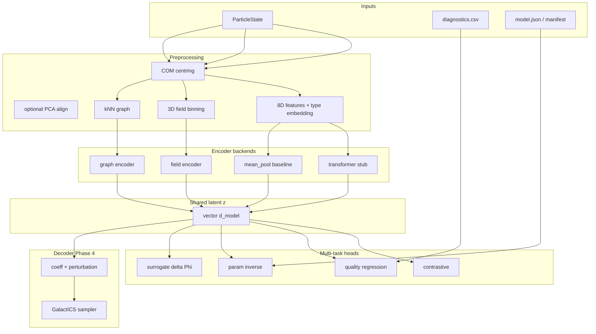

# ML encoder strategy for GalactICS particle data

This document is the authoritative roadmap for learned representations in
GalactICS.  It supersedes the high-level bullets in
[`ml_representation_roadmap.md`](ml_representation_roadmap.md) with concrete
architecture choices, phase plan, and code entry points.

## Executive summary

| Question | Answer |
|----------|--------|
| Is the vanilla `ParticleTransformerEncoder` sensible? | **As an integration stub only.** Untrained CLS-transformer over all particles is O(N²), lacks geometric bias, and does not scale to MW production counts (~200k). |
| What should we build instead? | **Field encoder first** (bin ρ, \|v\| per component), with **graph encoder** as the particle-local alternative. Multi-task heads on a shared latent. |
| Can we use astro "foundation models"? | **Not drop-in.** Galactification / MOSAIC operate on cosmological fields or galaxy property vectors—not isolated MW disk+halo particle ICs. Borrow design patterns, not weights. |
| How do we generate non-axisymmetric ICs? | **Coefficients + perturbation decoder**, not raw 200k-particle coordinate regression. |

## Problem framing

GalactICS campaigns produce:

- Parametric models (`model.json`) with DBH / multipole coefficients
- Particle ICs (`disk/`, `halo/`, `merged.dat`)
- Tiered evolution diagnostics (`evolution/diagnostics.csv`, `evolution/particles/step_*.npz`)

Learned encoders should compress snapshots into latents useful for:

1. **Campaign similarity** — cluster runs by halo.v0, disk mass, stability
2. **IC quality scoring** — predict ΔE/E₀, bin occupancy, ρ drift from IC alone
3. **Surrogate potentials** — small correction ΔΦ on top of harmonic/DBH
4. **Conditional IC generation** — non-axisymmetric perturbations in a reduced basis

These are **multi-task heads on one encoder**, not four separate models.

## Architecture overview



## Code map

| Module | Role |
|--------|------|
| [`particle_features.py`](../src/galacticsics/representations/particle_features.py) | 9-column export; `type_id` kept for I/O |
| [`preprocess.py`](../src/galacticsics/representations/preprocess.py) | COM, PCA; `ENCODER_FEATURE_NAMES` (8 cols, no type_id in linear layers) |
| [`learned.py`](../src/galacticsics/representations/learned.py) | `EncoderBackend`, `build_encoder()`, `LearnedRepresentation` + metadata |
| [`torch_encoder.py`](../src/galacticsics/integrations/torch_encoder.py) | Untrained transformer stub (8D + type embed) |
| [`field_encoder.py`](../src/galacticsics/integrations/field_encoder.py) | **Recommended** scalable stub: ρ/\|v\| grids → MLP |
| [`graph_encoder.py`](../src/galacticsics/integrations/graph_encoder.py) | kNN graph + mean aggregation stub |
| [`ml/training_data.py`](../src/galacticsics/ml/training_data.py) | Campaign bundle export |
| [`ml/heads.py`](../src/galacticsics/ml/heads.py) | Contrastive / quality / param head stubs |
| [`ml/decoders.py`](../src/galacticsics/ml/decoders.py) | Conditional IC decoder stub (coeffs + perturbation) |
| [`campaign/ml_hooks.py`](../src/galacticsics/campaign/ml_hooks.py) | Per-run and per-checkpoint encoding |

## Encoder backends

### `EncoderBackend.MEAN_POOL` (baseline)

Numpy mean of preprocessed 8D features, zero-padded to `d_model`.  Use for tests
and ablation baselines.

```python
from galacticsics.representations.learned import EncoderBackend, LearnedEncoderConfig, build_encoder

enc = build_encoder(LearnedEncoderConfig(backend=EncoderBackend.MEAN_POOL))
rep = enc.encode(batch)
assert rep.metadata.trained is False
```

### `EncoderBackend.FIELD` (recommended for campaigns)

Bin each particle type into `(ρ, |v|)` on a fixed 3D grid (`FieldGridConfig`).
Flatten → small MLP (untrained).  Scales to 200k+ particles because binning is
O(N).

```python
cfg = LearnedEncoderConfig(
    backend=EncoderBackend.FIELD,
    field_n_bins=32,
    field_r_max=30.0,
    d_model=128,
)
enc = build_encoder(cfg)
rep = enc.encode(batch)
field = rep.field  # shape (C, G, G, G)
```

Align grid bins with density analysis in
`notebooks/campaign_density_walkthrough.ipynb` for consistent supervision.

### `EncoderBackend.GRAPH`

kNN edges from positions (brute-force stub; replace with `cKDTree`).  One
message-passing round → global mean pool.  Natural path to e3nn / PyG and
surrogate force learning.

Subsamples to `graph_max_nodes` (default 4096) for tractability.

### `EncoderBackend.TRANSFORMER` (scaffold only)

8D linear projection + `nn.Embedding(type_id)` + CLS token +
`nn.TransformerEncoder`.  **Do not use at production N without subsampling.**

Marked `metadata.trained = False` always until a training loop exists.

### `EncoderBackend.PERCEIVER` (reserved)

Fixed M latent tokens attending to subsampled particles.  Not implemented;
raises `NotImplementedError` from `build_encoder()`.

## Preprocessing contract

All encoders should use [`PreprocessConfig`](../src/galacticsics/representations/preprocess.py):

| Flag | Default | Purpose |
|------|---------|---------|
| `center_com` | `True` | Remove mass-weighted COM from pos/vel |
| `pca_align` | `False` | Rotate into principal-axis frame |
| `mass_weighted_com` | `True` | Weight COM by particle mass |

`type_id` is **never** fed to linear layers; only to `nn.Embedding` in torch
backends.  Export files still contain 9 columns for backward compatibility.

## Training objectives (Phase 1)

Implemented as stubs in [`ml/heads.py`](../src/galacticsics/ml/heads.py):

| Objective | Labels source | Use |
|-----------|---------------|-----|
| `CONTRASTIVE` | Same run, different augmentations / timesteps | Similarity retrieval |
| `QUALITY_REGRESSION` | `dE_over_E0`, `active_fraction`, `mean_bin` from diagnostics | IC quality scoring |
| `PARAM_INVERSE` | `halo.v0`, `disk.mass` from `model.json` | Campaign metadata recovery |
| `FIELD_RECONSTRUCTION` | Binned ρ, \|v\| | Autoencoder pretraining |
| `POTENTIAL_CORRECTION` | Tree − harmonic accel on grid | Surrogate (Phase 3) |

### Contrastive pairs

Use trajectory dumps from tiered evolution:

- **Anchor:** IC latent (`t = 0`)
- **Positive:** latent from `evolution/particles/step_*.npz` same run (rotation augmented)
- **Negative:** latent from different campaign hash

## Campaign integration

### Export training bundle

```bash
python examples/export_campaign_training_data.py notebooks/artifacts/campaign_walkthrough \
  --backend field --write-fields
```

Writes:

```
ml_training/
  training_manifest.json
  <run_hash>/
    features.npz
    field.npy          # with --write-fields
    latent.npz
```

### Per-run encoding hook

```python
from galacticsics.campaign.ml_hooks import encode_run_directory, encode_evolution_checkpoints

encode_run_directory("runs/abc123", encoder_config=cfg)
encode_evolution_checkpoints("runs/abc123", encoder_config=cfg)
```

Outputs under `runs/abc123/ml/`.

### Planned runner integration

`run_campaign(..., encode_after_evolve=True)` is not wired yet.  Call
`encode_run_directory` from notebooks or a post-processing step until the runner
flag is added.

## Phase plan

### Phase 0 — Contract (current)

- [x] `EncoderBackend` + `build_encoder()` factory
- [x] Preprocessing module
- [x] Field / graph / transformer stubs with `metadata.trained = False`
- [x] Campaign export + ML hooks
- [x] Multi-task head + decoder stubs
- [x] This document

### Phase 1 — First trained model

1. Run full `campaigns/mw_grid.json` at production settings
2. Export bundle with `--backend field`
3. Train contrastive + quality regression (PyTorch Lightning or plain loop)
4. Benchmark: linear probe on `halo.v0`, ranking unstable vs stable runs

### Phase 2 — Campaign latents at scale

- Encode every evolve checkpoint; store `z` in manifest
- Compare latent distance vs harmonic V_c RMS in `compare` stage

### Phase 3 — Surrogate correction

- Condition small MLP on `z` + position → `delta_accel`
- Supervise against tree − harmonic residual (not end-to-end replacement)

### Phase 4 — Non-axisymmetric IC decoder

[`ConditionalICDecoder`](../src/galacticsics/ml/decoders.py) stub outputs:

- `HarmonicCoefficientTarget` — DBH/multipole coeffs
- `NonAxisymmetricPerturbation` — m=1, m=2 amplitudes, bar angle, triaxiality

Pipeline:

1. Decode coeffs + perturbation from `z` + campaign conditions
2. Run existing GalactICS builder for axisymmetric bulk
3. Apply perturbation in coefficient or velocity space
4. Short tiered evolve + quality head validation

**Do not** decode 200k raw (x, v) coordinates as the first generative model.

## Comparison to external foundation models

| External work | Representation | Relevance |
|---------------|----------------|-----------|
| [Galactification](https://arxiv.org/abs/2511.08438) | Multi-snapshot 3D DM ρ, v fields → galaxy catalog | Field-first encoding; different scale/output |
| [MOSAIC](https://arxiv.org/abs/2510.07684) | Galaxy scalars / SFH / spectra | Multi-task masking pattern; wrong modality |
| MACE / NequIP / e3nn | Local SE(3)-equivariant graphs | Architecture inspiration for graph encoder |
| Set Transformer / Perceiver | Subsampled set → latent | Scalable transformer alternative |

**Do not fine-tune Galactification or MOSAIC on MW ICs** — modality and task
mismatch.  Reuse their *design patterns* (fields, multi-task, masking).

## Dependencies

| Extra | Packages | Required for |
|-------|----------|--------------|
| `ml` | `torch>=2.0` | Transformer, field MLP, training |
| (future) `ml-geo` | `e3nn`, `torch-geometric` | Equivariant graph encoder |

Core `galacticsics` remains numpy-capable; field binning and graph stub work
without PyTorch.

## Testing

```bash
pytest tests/test_particle_features.py tests/test_ml_encoder_stubs.py -q
```

## Related documents

- [`ml_representation_roadmap.md`](ml_representation_roadmap.md) — taxonomy and quick reference
- [`performance_roadmap.md`](performance_roadmap.md) — tiered integrator, diagnostics
- [`full_mw_roadmap.md`](full_mw_roadmap.md) — production campaign settings
