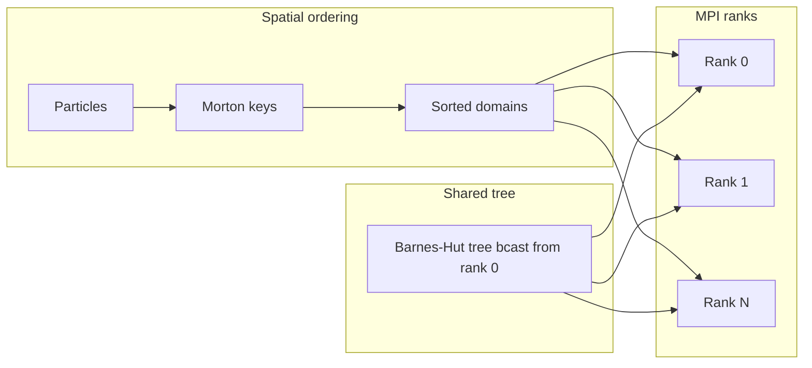

# ntropy

**ntropy** is a minimal N-body simulation package for testing initial conditions.
It integrates self-gravitating particle systems with configurable force methods,
variable Plummer softening, JSON-driven runs, and multiprocessing domain
decomposition in the spirit of Gadget-2.

It is **not** a production cosmology code. It is designed to answer: *do my
equilibrium initial conditions stay approximately stable over a short
self-gravitating evolution?*

## Install

From the repository root (installs both `galacticsics` and `ntropy`):

```bash
make install-dev
```

Or install ntropy alone:

```bash
pip install -e "src/ntropy[dev]"
```

## Units

ntropy uses the same **GalactICS internal units** as `galacticsics`:

| Quantity | Unit | Physical meaning |
|----------|------|------------------|
| Length | 1 | 1 kpc |
| Velocity | 1 | 100 km/s |
| Mass | 1 | 2.325×10⁹ M☉ |
| G | 1 | — |
| Time | 1 | ≈ 13.2 Myr |

Particle files use GalactICS ASCII format:

```
mass  x  y  z  vx  vy  vz
```

An optional first line `nobj flag` (from `gendisk`) is skipped automatically.

## Quick start

```bash
# Generate equilibrium IC files
ntropy-make-ic plummer examples/data/plummer_128.dat --seed 42

# Or generate all reference ICs
python src/ntropy/examples/make_all_ics.py

# Run from JSON config
ntropy-run src/ntropy/configs/plummer_short.json --report-density
```

## JSON configuration

Every run is defined by a JSON file. Required key: `particles.file`.

| Section | Key | Default | Description |
|---------|-----|---------|-------------|
| root | `seed` | 42 | RNG seed for reproducibility |
| `particles` | `file` | — | Path to ASCII particle file (relative to config dir) |
| `softening` | `default` | 0.01 | Default softening length ε |
| `softening` | `per_particle` | false | Use per-particle ε from sidecar file |
| `softening` | `file` | null | One ε per line (when `per_particle=true`) |
| `force` | `method` | `bh` | `brute` or `bh` |
| `force` | `theta` | 0.5 | Barnes–Hut opening angle |
| `integrator` | `type` | `leapfrog` | `leapfrog` (symplectic), `euler`, `rk2`, `rk3`, `rk4` (explicit, not symplectic) |
| `integrator` | `order` | `2` | Leapfrog only: `1` = symplectic Euler; `2` = velocity Verlet |
| `integrator` | `dt` | ~0.102 | Timestep in code units (default ≈ 1 Myr; 1000 steps/Gyr) |
| `integrator` | `n_steps` | 5000 | Number of steps (default 5 Gyr at 1000 steps/Gyr) |
| `parallel` | `enabled` | false | Enable multiprocessing |
| `parallel` | `n_workers` | 1 | Worker count |
| `parallel` | `mode` | `mpi` | Parallel backend (`mpi` recommended) |
| `output` | `dir` | `run_output` | Output directory |
| `output` | `every` | 0 | Snapshot interval (0 = no intermediate snapshots) |
| `output` | `write_final` | true | Write `final.dat` |
| `analysis` | `density_bins` | 20 | Spherical bins for ρ(r) |
| `analysis` | `r_max` | null | Outer radius for binning (null = auto) |

Example: [`configs/plummer_short.json`](configs/plummer_short.json).

## Force methods

### Brute force (`method: brute`)

Computes all pairwise Plummer-softened interactions. Complexity O(N²).
Exact reference for validation and small particle counts.

### Barnes–Hut tree (`method: bh`)

Builds a monopole octree. A node is opened when `size / distance ≥ theta`.
Larger `theta` is faster but less accurate. Use `theta ≈ 0.3–0.5` for tests.

## Variable softening

Pairwise softening length:

```
h_ij = 0.5 * (eps_i + eps_j)
```

Plummer softened acceleration:

```
a_i = -Σ_j  G m_j r_ij / (r_ij² + h_ij²)^(3/2)
```

Set per-particle values via a sidecar file and `"softening": {"per_particle": true, "file": "eps.dat"}`.

## MPI parallel forces (Gadget-2 style)

Parallel force evaluation uses **mpi4py** (installed by default with ntropy).
`make install-dev` also installs system OpenMPI (`openmpi-bin`, `libopenmpi-dev`)
when missing. Rebuild mpi4py after installing OpenMPI if import fails:

```bash
pip install --force-reinstall mpi4py
```

Launch multi-rank runs with:

```bash
mpirun -n 4 ntropy-run configs/plummer_short.json
```

Domain assignment mirrors Gadget-2:

```
All particles
    → Morton (Z-order) keys from positions
    → sort by key
    → split into comm.size contiguous domains
    → each rank computes forces on its domain targets
    → MPI allgather assembles the full acceleration array
```



When `mpirun` is not used (single rank), MPI falls back to the serial force
kernel automatically. **Limitations:** no distributed tree build, no periodic
boundaries.

## Initial condition models

All examples are **fully self-gravitating** with small particle counts.

### Truncated NFW halo

```
ρ(r) ∝ [r/a (1+r/a)²]⁻¹ × exp(-r/r_trunc)
```

Eddington inversion on a tabulated ρ(r) yields f(E); particles sampled in
isotropic equilibrium. Default: N=256, M=100, a=10 kpc, r_trunc=80 kpc.

### Sersic bulge

```
ρ(r) ∝ r^(-1/n) exp(-(r/r_e)^(1/n)) × exp(-r/r_trunc)
```

Default: N=128, n=4, r_e=0.5 kpc.

### Exponential disk

Truncated exponential disk matching legacy GalactICS / `gendisk`:

```
Σ(R) = Σ₀ exp(-R/R_d) × ½ erfc((R - R_out)/ΔR)
ρ(R,z) = Σ(R) / (2 z_d) × sech²(z/z_d)
```

Default: N=256, M=20, R_d=3 kpc, z_d=0.3 kpc. Disk stability tests compare
midplane `Σ(R)` against this target.

### Composite systems

`sample_composite()` merges halo, bulge, and/or disk components. Tests cover
all seven combinations of the three components.

### Plummer sphere

```
ρ(r) = (3M / 4πa³) (1 + r²/a²)^(-5/2)
```

Distribution function from the **Abel transform**:

```
f(E) = (1/√(8π²)) ∫₀^E (d²ρ/dΨ²) / √(E-Ψ) dΨ + (1/√(8π²)) (dρ/dΨ)|₀ / √E
```

Implemented numerically via `scipy.integrate` and cross-checked against the
analytic Plummer DF in unit tests.

## Density stability tests

The core validation workflow:

1. Generate equilibrium IC with fixed `seed=42`.
2. Bin particles into spherical shells → ρ(r).
3. Evolve self-gravitating for 20–50 short steps.
4. Compare final ρ(r) to initial; assert max relative shell deviation < 25%.

The 25% threshold is intentionally loose: small N, softening, and BH
approximation all broaden profiles. Large systematic drift signals bad ICs.

Run tests:

```bash
pytest src/ntropy/tests/ -v
```

## CLI reference

| Command | Description |
|---------|-------------|
| `ntropy-run CONFIG.json` | Run simulation from JSON |
| `ntropy-run CONFIG.json --report-density` | Also print ρ(r) drift |
| `ntropy-make-ic MODEL OUTPUT` | Generate IC (`nfw`, `sersic`, `plummer`) |

## Python API

```python
from ntropy import load_config, run_simulation
from ntropy.ics import sample_plummer

state = sample_plummer(seed=42)
cfg = load_config("configs/plummer_short.json")
result = run_simulation(cfg, state=state)
print(result.energies[-1])
```

## Relationship to galacticsics (integrated workflow)

| galacticsics | ntropy |
|--------------|--------|
| Build ICs (`dbh`, `genhalo`, `gendisk`) | Evolve ICs (short N-body test) |
| Self-consistent multipole solver | Direct particle-particle gravity |
| Legacy Fortran bridge | Pure Python/NumPy/SciPy |

**Production path** — use `ntropy.integrations.galacticsics`:

```python
from ntropy.integrations.galacticsics import sample_galacticsics_halo
from ntropy.simulation import Simulation

ic = sample_galacticsics_halo(n_particles=256, seed=-42, eps=0.04)
result = Simulation(cfg, state=ic.state).run()
```

Or sample disk+halo from precomputed artifacts:

```python
from galacticsics.artifacts.paths import default_artifact_dir, reference_model
from galacticsics.sampling.sampler import SampleConfig
from ntropy.integrations.galacticsics import sample_galacticsics_galaxy

config = SampleConfig(n_disk=200, n_halo=200, run_diskdf=False)
ic = sample_galacticsics_galaxy(
    reference_model(), config, artifact_dir=default_artifact_dir(), solve=False
)
```

See [`notebooks/nfw_halo_walkthrough.ipynb`](../../notebooks/nfw_halo_walkthrough.ipynb) for the full end-to-end demo.

`ntropy.ics.*` provides **standalone analytic samplers** (no legacy build) for fast regression tests only.

## Package layout

```
src/ntropy/
├── pyproject.toml
├── README.md
├── ntropy/
│   ├── config.py
│   ├── particles.py
│   ├── softening.py
│   ├── simulation.py
│   ├── forces/          # brute, Barnes–Hut
│   ├── integrators/     # leapfrog
│   ├── parallel/        # Morton domains, multiprocessing
│   ├── ics/             # NFW, Sersic, Plummer, disk, composite
│   └── analysis/        # spherical ρ(r), disk Σ(R)
├── configs/
├── examples/
└── tests/
```

## References

- Barnes & Hut (1986) — tree algorithm
- Springel (2005) — Gadget-2 domain decomposition
- Binney & Tremaine (2008) — Eddington/Abel DF inversion
- Navarro, Frenk & White (1997) — NFW profile
